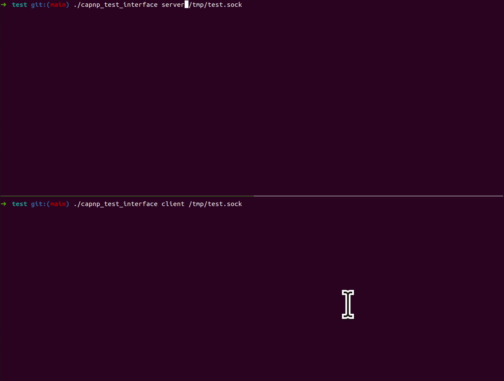

`capnp_trace` is a debug tool that intercepts and records Cap'n Proto RPC which are called by a process and received by a process.



## 💪 Features

- Launch sub process and trace its Cap'n Proto RPC
- Attach existing process and trace its Cap'n Proto RPC
- Record Cap'n Proto RPC and parse it offline
- Signal injection based on Cap'n Proto RPC

### Supported OS

- Linux (x86-64, aarch64)

## 📥️ Installation

`capnp_trace` needs to be built with your Cap'n Proto schemas to deserialize.  
If you don't specify `CAPNP_TRACE_SCHEMA_DIRS`, `capnp_trace` can record, but cannot deserialize message.  

```shell
cmake -B build -S . -D CAPNP_TRACE_SCHEMA_DIRS="<YOUR-SCHEMA-DIRECTORY1>;<YOUR-SCHEMA-DIRECTORY2>"
cmake --build build
cmake --install build
```

## 🚀 Usage

- `capnp_trace` has the following sub commands. If you need detail info for each sub-command, please see `capnp_trace <sub_command> --help`.

```shell
$ capnp_trace --help 
Usage: capnp_trace [<option>...] <command> [<arg>...]

Command-line tool for Cap'n Proto RPC tracing.

Commands:
  attach  Attach to the existing thread and trace it.
  exec    Fork and exec new process and trace it.
  parse   Parse recoreded/dumped files.

See 'capnp_trace help <command>' for more information on a specific command.

Options:
    --verbose
        Log informational messages to stderr; useful for debugging.
    --version
        Print version information and exit.
    --help
        Display this help text and exit.
```

## 📜 License

[MIT License](https://opensource.org/license/mit)
