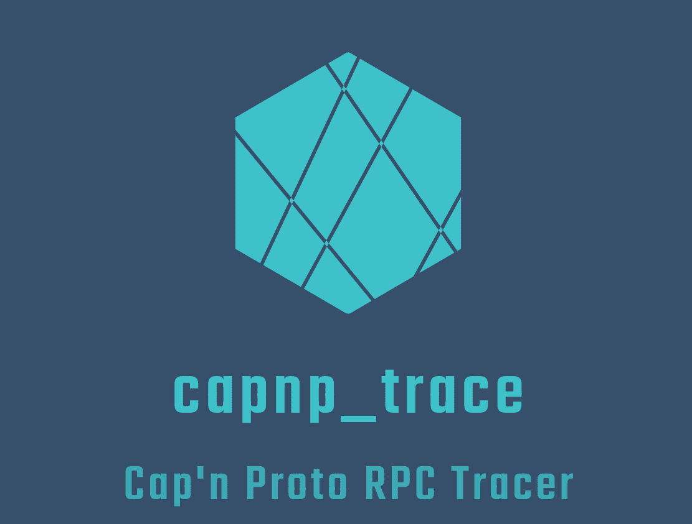

`capnp_trace` is a debug tool that intercepts and records Cap'n Proto RPC which are called by a process and received by a process.


## 💪 Features

- Launch sub process and trace its Cap'n Proto RPC
- Attach existing process and trace its Cap'n Proto RPC
- Record Cap'n Proto RPC and parse it offline
- Signal injection based on Cap'n Proto RPC

### Supported OS

- Linux (x86-64, aarch64)

## 📥️ Installation

`capnp_trace` needs to be built with your Cap'n Proto schemas to deserialize.  
If you don't specify `CAPNP_TRACE_SCHEMA_DIRS`, `capnp_trace` can record, but cannot deserialize message.  

```shell
cmake -B build -S . -D CAPNP_TRACE_SCHEMA_DIRS="<YOUR-SCHEMA-DIRECTORY1>;<YOUR-SCHEMA-DIRECTORY2>"
cmake --build build
cmake --install build
```

## 🚀 Usage

## 📜 License

[MIT License](https://opensource.org/license/mit)
